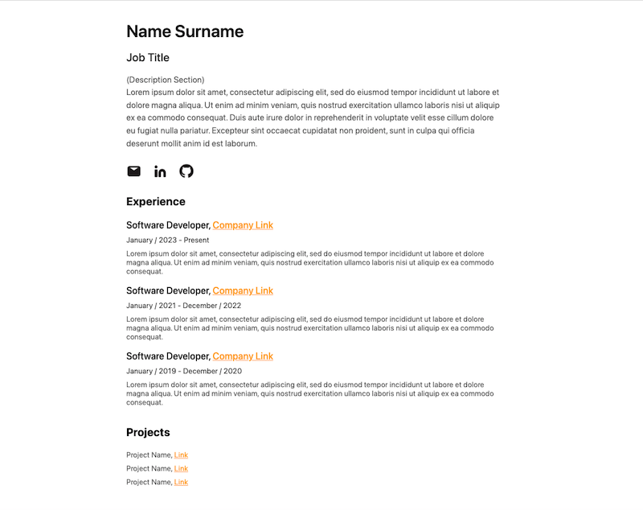

# personal-website-template
Simple, personal website template for software developers.

A simple, useful and fully responsive personal website template for software developers.

You can use it by downloading the project file and editing the HTML and CSS codes personally, without any installation or setup required.
Anyone can use the template on github pages (https://pages.github.com) or on custom website.
You can add or remove new sections or customize them as you wish.

Project Creator Page: https://sametbugraoktay.github.io

Example page views Fullscreen and Responsive:

REFERENCES:
Icon images have been downloaded from https://akveo.github.io/eva-icons/#/ 
